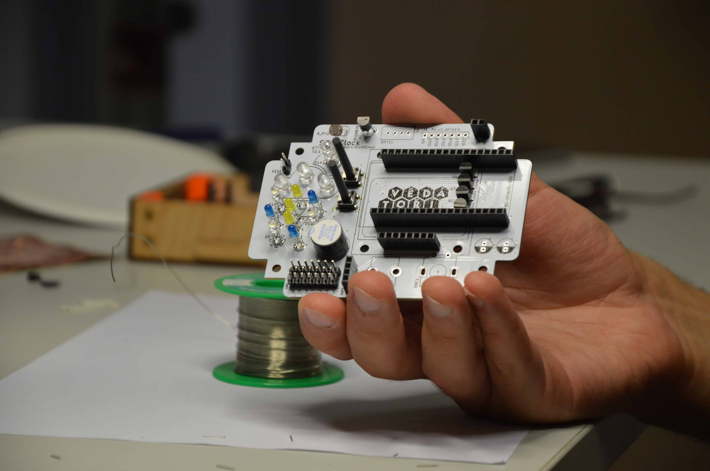

V této kapitole je návod pro osazení desky plošných spojů pro SleetClock. V první části je osazována hlavní deska, v druhé části je popsáno osazení externího senzoru.
___
# Obsah
* [Seznam součástek](#seznamSleet)
* [Rozlomení PCB](#rozlomeni)
* [Zapájení SMD rezistorů](#smdR)
* [Zapájení SMD kondenzátorů](#smdC)
* [Zapájení kolíkových lišt](#kolik)
* [Zapájení dutinkových lišt](#dutinky)
* [Zapájení tranzistorů BC547A](#tranzistory)
* [Zapájení bzučáku](#bzucak)
* [Zapájení teplotního senzoru Dallas DS18B20](#dallas)
* [Zapájení fotorezistoru](#fotoR)
* [Zapájení 25mm tlačítek](#tlac)
* [Zapájení luminiscenčních diod (LED)](#LED)
* [Zapájení potenciometru a enkodéru](#potenc)
* [Dokončení vývojové desky](#finish)
___

## Seznam součástek
+ Vyfrézovaná PCB (Printed Circuit Board - deska plošných spojů)
+ PCA9685
+ SMD Rezistory vel. 1206 (před závorkou je uvedena hodnota, v závorce kódové označení na rezistoru)
    + 4x 51 Ω (510)
    + 3x 330 Ω (331)
    + 2x 1 KΩ (102)
    + 1x 4,7 KΩ (472)
    + 6x 10 KΩ (103)
    + 4x 22 KΩ (223)
+ 4x SMD kondenzátor 220 nF (bez popisku), vel. 1206
+ Teplotní senzor DS18B20
+ Fotorezistor
+ Kolíkové lišty
+ Dutinkové lišty
+ LED
    + RGB se společnou katodou (nejdelší nožička)
    + 3x 5 mm studená bílá
    + 3x 3 mm studená bílá
    + 3x 3 mm modrá
    + 3x 3 mm žlutá
+ Bzučák
+ 2x tlačítko 25 mm
+ 4x tranzistor BC547A
+ Potenciometr 10 KΩ s hřídelí 18mm
+ Rotační enkodér
+ ESP32 devkit
+ Nokia 5110 display
+ Jumper
+ 4x šroub M3x20 s půlkulatou hlavou
+ 8x matka M3
+ 3D tištěný tepelný štít

Součástky na zapájení do PCB můžete vidět na následujícím obrázku:

## Rozlomení PCB
1. Na jednom PCB je umístěna jak hlavní deska, tak i deska externího senzoru. PCB je frézovaná, rozlomte ho na dvě části podle drážky. To by mělo jít bez použití nadměrné síly.

2. Po rozlomení opracujte nově vzniklé hrany smirkovým papírem.

#### Pohled na hlavní PCB
Toto je pohled na PCB zepředu. Z této strany se SleetClock běžně nepájí! Existuje však jedna výjimka, ale o té se v návodu dočtete. :)

Takto vypadá SleetClock zezadu. Z této strany budete pájet naprostou většinu součástek. Jako malý dárek už od nás máte zapájené PCA (integrovaný obvod SOIC). :) To má tak malé rozteče vývodů, že jsme pro něj zvolili jinou techniku pájení. Jen si zkontrolujte, že tam opravdu je.

#### Osazení hlavní PCB
Součástky pajíme do PCB v pořadí podle 2 klíčů:
* Nejdříve nejmenší - ať neblokují místo při pájení dalších součástek
* Nejdříve teplotně nejodolnější - kdyby došlo k jejich nahřátí při dalším pájení
Tyto dvě metody nejdou vždy ruku v ruce, je tedy zvolen vhodný kompromis.

Následující součástky (SMD - Surface Mount Device) se na desku přikládají i pájí ze spodní strany (bez nápisu SleetClock).

## <a name = "smdR">Zapájení SMD rezistorů</a>
Nyní zapájejte SMD rezistory.
Jako první pájejte SMD rezistor hodnoty 4,7 KΩ. Je na něm napsáno “472”, což je myšleno jako 47*10^2. Takto jsou značeny všechny použité SMD rezistory. Tento rezistor zapájejte na místo s označením 4K7.
Nápisy na rezistorech musí směřovat nahoru, aby zůstaly čitelné. Stejně tak nesmí být nápis na rezistoru “vzhůru nohama”.    
1. Nahřejte jednu plošku pro SMD rezistor a přidejte na ni malé množství cínu.
1. Pinzetou uchopte rezistor a přiložte ho na cín, který se uchytil na plošce. Dbejte na jeho správné usazení, nesmí být posunutý a nesmí stát ve vzduchu.\  
1. Cín nahřejte páječkou. Pinzetou dolaďte umistění rezistoru, když je cín roztavený.

1. Zapájejte druhý vývod rezistoru. Nahřejte vývod a plošku a poté přidejte malé množství cínu potřebné k jejich spojení.\

1. Obdobným způsobem zapájejte ostatní rezistory. Na polích s více rezistory si vždy naneste cín na všechny plošky na jedné straně a poté po jednom pinzetou přikládejte rezistory. Ty musí být vpájeny do správných míst podle popisků na plošném spoji podle následujícího rozpisu (před závorkou je uvedené označení na desce a v závorce kód rezistoru):
    + 4x 51R (510)
    + 3x 330R (331)
    + 2x 1K (102)
    + 1x 4K7 (472)
    + 6x 10K (103)
    + 4x 22K (2202)

## <a name = "smdC">Zapájení SMD kondenzátorů</a>
SMD kondenzátory se pájí obdobným zůsobem jako SMD rezistory. Jedná se o hnědé součástky zabalené v podobné pásce. Nemají na sobě žádné označení, ale všechny čtyři mají stejně velkou kapacitu.
1. Připájejte je na místa označená 220nF.\

Následující součástky se do desky vkládají z přední strany (tam, kde je nápis SleetClock). Pájí se ale pořád ze spodní strany (bez nápisu).

## <a name = "kolik">Zapájení kolíkových lišt</a>
Kolíková lišta v její původní podobě má 40 pinů. Z ní štípacímí kleštěmi ustřihněte více částí, jedna bude mít 2 piny, další tři poté po sedmi pinech každá. Při odštípávaní kolíkových lišt dbejte na to, abyste nepoškodili plastovou část kolíkové lišty, kterou budete potřebovat.

1. První bude zapájena 2pinová kolíková lišta, a to nad symboly počasí k nápisu RESET. Tu umístěte shora do PCB. Delší strana kolíkové lišty musí zůstat na horní straně desky.\
 
1. Ze zadní strany PCB zapájejte jeden pin. Pokud je kolíková lišta zapájená nakřivo, narovnejte ji mírným ohnutím.\

1. Zapájejte druhý kolík lišty.\
 
1. Obdobným způsobem zapájejte všechny 7pinové kolíkové lišty (nejdříve zapájet pouze jeden pin a poté zarovnat). Budou připájeny pod symboly počasí tam, kde je označení S0...S6.\

## <a name = "dutinky">Zapájení dutinkových lišt</a>
Dutinkové lišty mají stejně jako kolíkové v základu 40 pinů. I ty bude potřeba dělit pomocí štípacích kleští. Oproti nim je v postupu takový rozdíl, že při jejich dělení se neštípá mezi jednotlivými piny, ale odpočítá se potřebný počet pinů a odštípnutí se porvede u dalšího pinu, který se tím zničí a z lišty vypadne. Pokud tedy potřebujeme 19pinovou dutinkovou lištu, odštípneme ji až u dvacátého pinu.

Po odpadlém pinu zůstane prázdné místo, to začistíme zalamovacím nožem do rovna tak, aby vypadalo stejně jako kraj dutinkové lišty odlitý v továrně.

1. První budou zapájeny dvě 19pinové dutinkové lišty, a to do míst u velkého loga Vědátoři. Umístěte je shora do PCB. Černá část kolíkové lišty musí zůstat na horní straně desky.
1. Ze zadní strany PCB zapájejte jeden pin. Pokud je lišta zapájená nakřivo, narovnejte ji mírným ohnutím.\

1. Zapájejte ostatní kolíky lišty.\
 
1. Obdobným způsobem vytvořte a zapájejte všechny ostatní dutinkové lišty:
    * 4pinovou k nápisu J10 vedle již zapájených kolíkových lišt
    * 8pinovou pod velké logo Vědátoři, k nápisům RST, CE, DC, DIN,...
    * 2pinovou k nápisu J2 v pravé horní části desky

    
## <a name = "tranzistor">Zapájení tranzistorů BC547A</a>
Do SleetClock zapájíte čtyři tranzistory BC547A. Zkontroluje důsledně u každého, jestli má na pouzdře opravdu nápis BC547A. Stejný typ pouzdra má totiž i teplotní senzor (s nápisem DALLAS), který použijeme později. Tranzistory pájejte jedem po druhém.
1. Tranzistor umístěte shora do PCB. Orientace jeho pouzdra musí odpovídat nákresu na PCB.\
 
1. Krajní nožičky ohněte směrem ven.\

1. Zapájejte jednotlivé vývody tranzistoru.\

1. Obdobným způsobem zapájejte ostatní tranzistory.\

## <a name = "bzucak">Zapájení bzučáku</a>
Pozor na polaritu bzučáku, na desce je vývod + nalevo. Na součástce je krycí fólie, na které je + také nazančeno, tyto + musí jít k sobě.
1. Bzučák umístěte shora do DPS.\

1. Ze spodu zapájejte.

## <a name = "dallas">Zapájení teplotního senzoru Dallas DS18B20</a>
Zkontrolujte, že na součástce je napsáno DALLAS.
1. Součástku umístěte do horní části PCB k nápisu DS18B20. Zkontrolujte, že je otočená stejně jako nákres na PCB.\

1. Zapájejte stejným způsdobem jako tranzistor.

## <a name = "fotoR">Zapájení fotorezistoru</a>
1. Fotorezistor umístěte vedle teplotního senzoru na místo označené R_PHOTO tak, aby jeh horní strana byla stejně vysoko jako dutinkové lišty. Ze spodu zahněte vývody.\

1. Otočte desku a zapájejte.\
 

## <a name = "tlac">Zapájení 25mm tlačítek</a>
Nyní zapájejte obě vysoká tlačítka. Jejich umístění je vedle symbolů počasí.
1. Pomocí plochých kleští zarovnejte vývody tlačítek.\

1. Tlačítko umístěte do PCB z přední strany.\

1. Pozor, vysoká tlačítka jsou jediná součástka, kterou je výhodnější zapájet z přední strany desky. Tlačítko zapájejte.\

1. Stejně zapájejte i druhé tlačítko.\

## <a name = "LED">Zapájení luminiscenčních diod (LED)</a>
K symbolům počasí zapájejte LED podle následujícího postupu:
1. RGB LED (se čtyřmi vývody) vložte do symbolu slunce. Nejdelší vývod umístěte k nápisu GND na desce.\

1. LED se půjde do desky vsunout až do vzdálenosti několika mm, poté na ni přestaňte tlačit a zapájejte.\

1. LED v 5mm pouzdru (stejné velikosti jako RGB LED) zasuňte až na doraz k desce do jejich míst v symbolu mraku.
1. Zezadu zahněte vývody tak, aby se LED vsunutá v desce nehýbala a zapájejte.\

Dále zapájejte 3mm (menší) žluté LED do míst v symbolu blesku, modré k symbolům kapky a bílé k symbolům vločky. LED musí být v dané výšce, to provedete následujícím způsobem:
Umístěte LED na příslušné místo do takové výšky, aby její spodní strana byla zarovnaná s horní stranou dutinkové lišty.

Ze spodní strany desky zahněte vývody.

Zapájejte jeden z vývodů.

LED narovnejte tak ,aby byla kolmá na PCB a nad svým symbolem na DPS.
Zapájejte druhý vývod.
1. Tímto způsobem zapájejte všechny 3mm LED jednu po druhé na jejich příslušná místa. Pořád dávejte pozor na jejich polaritu.\

## <a name = "potenc">Zapájení potenciometru a enkodéru</a>
1. Potenciometr umístěte na jeho místo označené POT1. Skrz PCB vsuňte všechny tři elektrické i oba velké fixační vývody součástky. Pokud je to nutné, vývody dorovnejte.\

1. Ze spodní strany PCB zapájejte oba fixační vývody i všechny elektrické.\

1. Obdobným způsobem usaďte a zapájejte rotační enkodér. Ten má dva fixační vývody a pět elektrických, ty jsou ze spodní i horní strany součástky.\

## <a name = "finish">Dokončení vývojové desky</a>
1. Zasuňte ESP32 do připravených dutinkových lišt až na doraz tak, aby microUSB konektor směřoval k pravému okraji desky.\

1. Ze zadní strany PCB zasuňte 4 šrouby M3x20 a zajistěte shora M3 maticemi.\

1. Na každý šroub našroubujte další M3 matici tak, aby nahoře zbyl asi 1 mm závitu.\

1. Nasuňte Nokia 5110 display. Jeho vývody musí zajet do dutinkové lišty, která je na ně připravena a do děr v jeho desce musí padnout připravené šrouby M3x20.\

1. Vložte 3D tištěný tepelný štít nalevo od obrazovky. Měl by zapadnout až těsně k PCB.\
