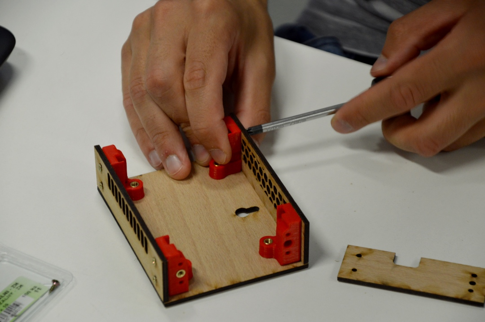

V této kapitole je návod pro sestavení SleetClock ze základních dílů, které lze najít v OnShape. Základem pro sestavení je osazená deska plošných spojů, dále jsou třeba mechanické díly. Část dílů je určena pro tisk na 3D tiskárně, část dílů je navržena pro vyřezání z překližky laserem. Zbytek jsou běžně dostupné díly z hobby marketu.
___
# Obsah
* [Seznam součástek](#seznam)
* [Příprava překližkových dílů](#preklizka)
* [Osazení bočnice s magnety](#bocnice)
* [Kompletace krabičky](#krabicka)
* [Kompletace víka](#viko)
* [Osazení magnetů](#magnety)
* [Finalizace mechaniky](#finalizace)
___

## <a name = "seznam">Seznam součástek</a>

### 3D tištěné díly
+ 4x Bočnice
+ 4x Držák víka
+ 1x difuzor pro symboly počasí
+ 2x Krytka osky pro potenciometr a enkodér

### Desky z překližky
+ Levý bok
+ Pravý bok
+ Horní bok
+ Spodní bok
+ Dno
+ Víko
+ 2x Opěrka

### Hobby market
+ 4x Magnet
+ 6x Závitová vložka M3x5
+ 24x Vrut 2,5x10
+ 4x Šroub M3x6 mm s půlkulatou hlavou
+ 2x Šroub M3x10 mm se zapuštěnou hlavou

Obrázek zleva zobrazuje: Vrut 2,5x10, Závitovou vložku M3x5, Šroub M3x6 mm s půlkulatou hlavou, Šroub M3x10 mm se zapuštěnou hlavou

## <a name = preklizka>Příprava překližkových dílů</a>
1. Otvory pro šrouby se přizpůsobí vyštípnutím části překližky šroubovákem. Kolem každého otvoru, který je potřeba přizpůsobit, jsou vypáleny další struktury ve tvaru terče tak, aby nebyly proříznuty v celé tloušťce překližky. Malým plochým šroubovákem opatrně postupně vyštípněte jednotlivé části pomyslného terče vytvořeného kolem otvoru na překližce. Dávejte pozor, abyste nevyštípli materiál do moc velké hloubky tak, že vyštípnete všechny vrstvy překližky. Ideální je zasáhnout pouze jednu vrstvu, maximálně dvě ze tří. Vyštípnout části lze umístěním šroubováku jako na obrázku nebo tak, že šroubovák umístíte do vyřezaného otvoru a zatlačíte proti překližce v polovině její tloušťky.\

1. Všechny dřevěné díly opracujte smirkem hrubosti P400 až P800. Pokud na dílu nejsou žádné viditelné ani nahmatatelné nečistoty, stačí jen jednou jemně přejet smirkem.\

1. Takto připravené dřevěné díly nalakujte lakem ve spreji.\

## <a name = bocnice>Osazení bočnice s magnety</a>
K tomuto kroku jsou třeba 4 bočnice, 6 závitových vložek, z nástrojů pak pájka a ploché kleštičky. Bočnice nejsou všechny stejné, otvor na závitovou vložku směřuje doleva nebo doprava. Potřebovat budete od každého typu dvě. Pozor! Závitové vložky mají jednu stranu zkosenou. Zkosená strana musí po vložení závitové vložky vyčnívat ven, lépe navede šroub při zašroubování.

1. Nachystejte si díly podle obrázku a rozehřejte pájku na 300 °C.\

1. Vezměte do kleštiček závit, do závitu přiložte horkou pájku a závit rozehřejte.\

1. Závit postupně vsouvejte do bočnice.\

1. Odložte pájku do stojánku. Bočnici chytněte za plastovou část a závit jemně zalisujte např. o hranu stolu.\

1. Tento postup opakujte pro zbylé 3 bočnice.\
        
1. Bočnice vystavte na stůl dle obrázku. Pro spodní 2 bočnice stejným postupem z předešlých bodů "vpalte" boční závity. Pozor v tomto případě se bočnice mohou snadno převrhnout.\

1. Nezpomeňte opět jemně zalisovat o stůl.\

## <a name = krabicka>Kompletace krabičky</a>
K tomuto kroku budou třeba všechny doposud vyrobené díly. Z nástrojů křížový šroubovák PH1 nebo PZ1, šroubky (*výčet šroubků*), lihový fix a lepidlo.

1. Opracované díly si vyskládejte na stůl podle obrázku. Označené bočnice mají z boku vpálený závit.\

1. Všechny bočnice postupně přišroubujte ke dnu, šrouby nedotahujte doplna.\

1. Připevněte spodní díl do bočnic, šrouby opět nedotahujte.\

1. Obdobně horní díl. Zkontroulujte, že máte závity vpálené na stejných místech jako na obrázku, a že máte stejně rozmístěné děrování.\

1. Připevněte boční díly. Opět zkontrolujte, že máte vše ve shodě s obrázkem.\

1. Vycentrujte krabičku, aby seděla do pravých úhlů a postupně jemně dotáhněte.\

## <a name = viko>Kompletace víka</a>

1. Nyní přišroubujte držáky magnetů k víku. Směr držáků dodržte stejně jako na obrázku.\

1. Výsledkem by měl být stav z následujích 2 obrázků.\

1. Kolem výřezů, které naznačují ikony počasí naneste lepidlo.\

1. Přebytečné lepidlo odstraňte kusem papíru.\

1. Nanesenou vrstvu lepidla nechte několik minut odvětrat.\

1. Přilepte díl s difuzorem.\

1. Zkontrolujte přesnost centrování proti světlu. Lepidlo by ještě nemělo být zaschlé a s difuzorem by mělo být možné pohybovat po desce. Pokud to je možné, s difuzorem pohybujte klouzáním po desce, již od desky neodlepujte.\

## <a name = magnety>Osazení magnetů</a>

1. Magnety rozdělte na dvojice. Lihovým fixem označte tečkou vnější strany dvojice magnetů. Strany, které mají vůči sobě kontakt ponechte prázdné.\

1. Naneste lepidlo do prostoru pro magnety na bočnicích krabičky.\

1. Vložte magnet tak, abyste neviděli tečky, které jste vytvořili v předešlém kroku. Odstraňte papírem přebytečné lepidlo.\

1. Postup opakujete pro víko. **Krabičku nezavírejte minimálně po dobu jedné hodiny.** Hrozí totiž trvalé slepení plastových dílů nebo posunutí magnetů.\

## <a name = finalizace>Finalizace mechaniky</a>

1. Pomocí šroubů M3x10 se zapuštěnou hlavou přišroubujte oba stojánky. Hlavičky šroubů musí být zapuštěny do připravených otvorů ve stojáncích.\

1. Přišroubujte zkompletovanou desku PCB pomocí 4 šroubů M3x6 s půlkulatou hlavou.\

1. Nasaďte překližkové víko s magnety na krabičku.\

1. Na vyčnívající osky potenciometru a enkodéru nasuňte tištěné krytky.\
