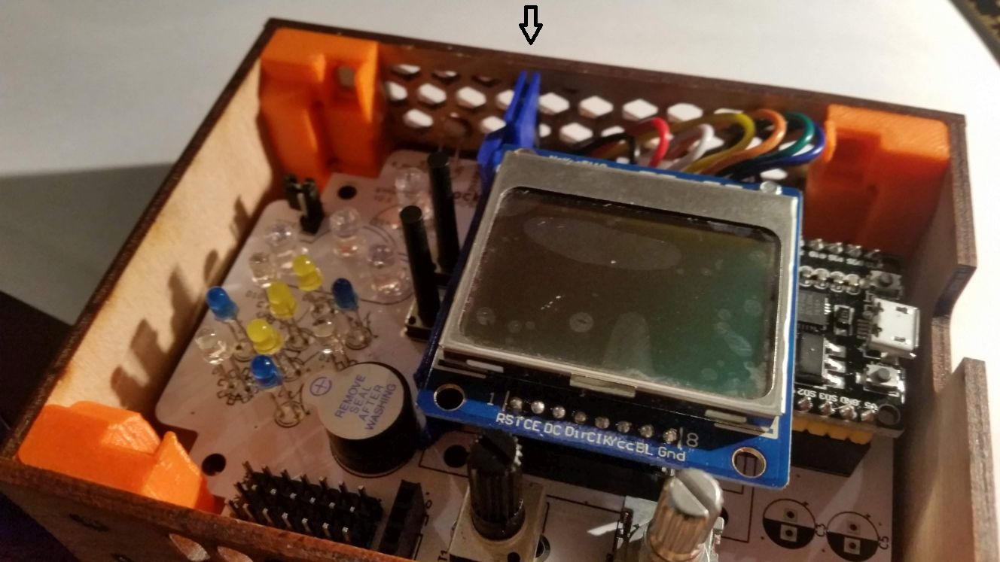

V této kapitole je návod pro vybavení meteostanice SleetClock kapacitními senzory pro ovládání dotykem na dřevo.

# Obsah
* [Seznam součástek](#seznam)
* [Pájení konektoru dod PCB](#doPCB)
* [Příprava vodičů](#vodice)
* [Kapacitní plochy](#kapacity)
* [Kompletace](#komplet)

## <a name = "seznam">Seznam součástek</a>
+ 7 žilový kabel s konektorem
+ 7 cm měděné lepicí pásky šířky 6 mm

## <a name = "doPCB">Pájení konektoru do PCB</a>
1. Odšroubujte s 4 vruty z horní části krabičky s šestihrannou mřížkou.\

1. Odeberte horní část krabičky.\

1. Vyjměte elektroniku a vložte do ní 7 pinový konektor podle obrázku. Pozor na orientaci konektoru.\

1. Zapájejte všech 7 pinů ze zadní strany PCB.\

## <a name = "vodice">Připrava vodičů</a>
1. Štípacími kleštěmi ucvakněte 7 žilový kabel v délce 5 cm od konce konektoru.\

1. Nožem odizolujte konce vodičů v délce asi 3 mm.\

1. Ocínujte konce vodičů.\

## <a name = "kapacity">Kapacitní plochy</a>
1. Nalepte 7 cm dlouhý kus měděné pásky do vnitřní strany horní desky krabičky. Měděný pásek musí být zarovnán s šestihrannou mřížkou.\

1. Ostrým předmětem naznačte do měděné pásky čáry ve vzdálenostech 1 cm.\

1. V naznačených čarách vyřízněte měď v šířce 1 mm tak, aby vzniklo 7 samostatných měděných kusů.\

1. Pájkou ocínujte středy 7 měděných ploch.\

1. Připájejte všech 7 vodičů k měděným plochám přesně podle obrázku.

## <a name = "komplet">Kompletace</a>
1. Zapojte konektor s vodiči do PCB.\

1. Přiložte horní stranu krabičky do původní polohy.\

1. Zašroubujte zpět 4 vruty držící horní díl krabičky.\

1. Uspořádejte vodiče dolů tak, aby nepřekážely tepelnému štítu.\
