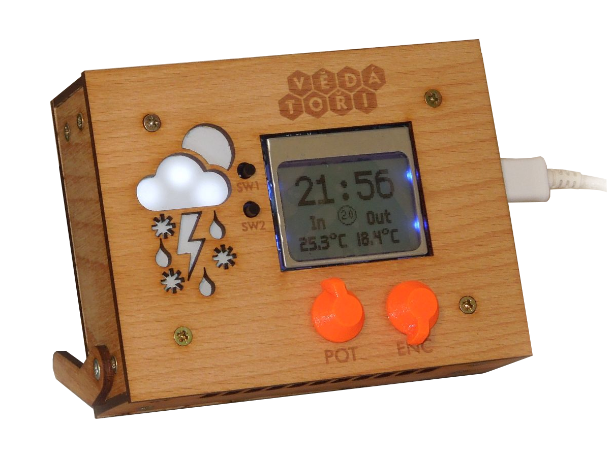
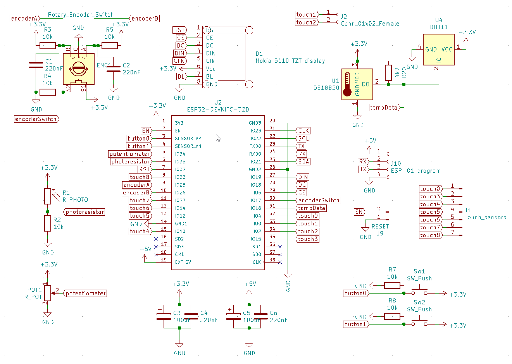
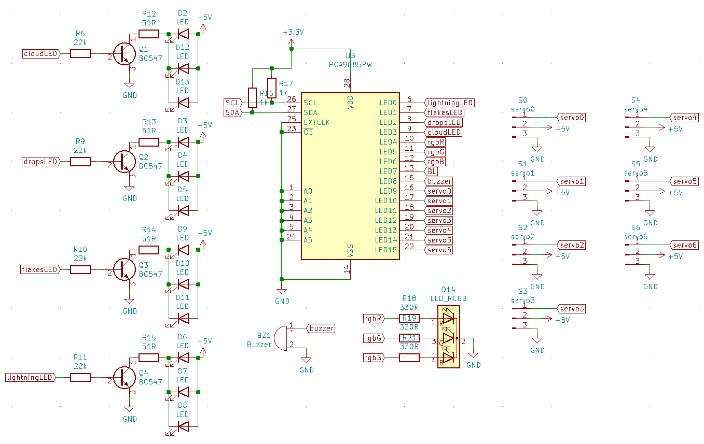
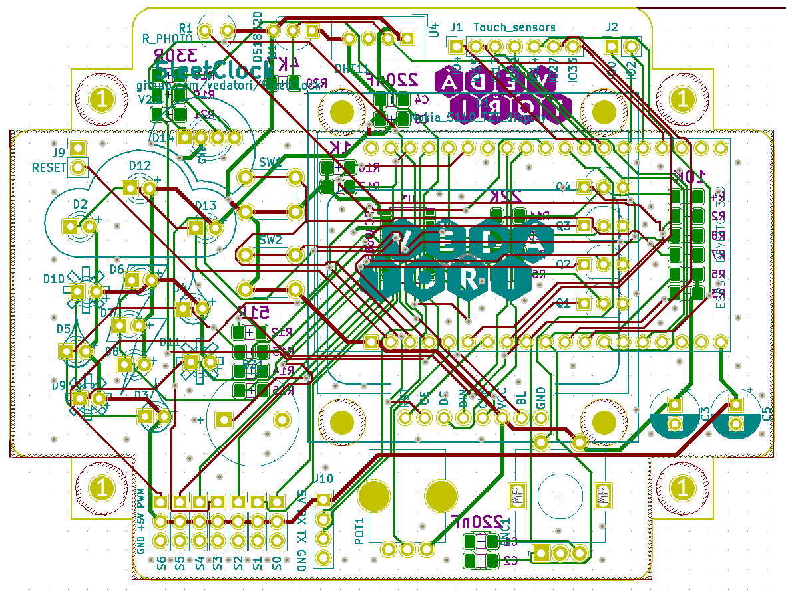
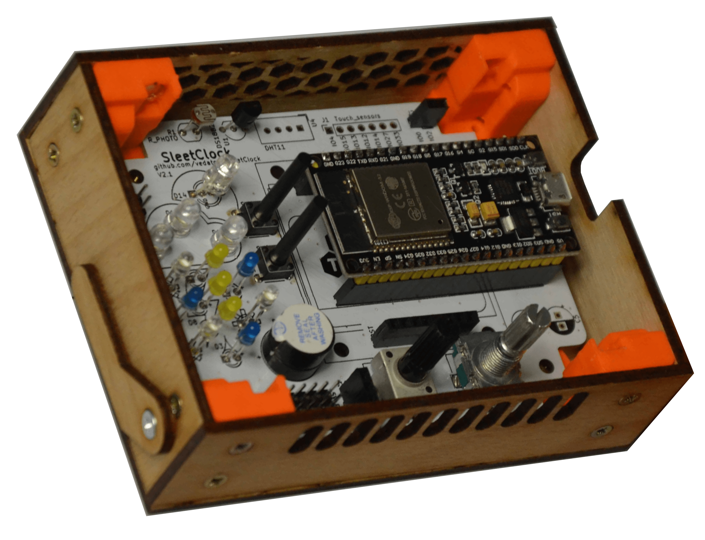

# SleetClock [cz]
SleetClock je otevřená platforma chytré meteostanice vyvinutá jako projekt pro výuku elektroniky a programování. Ve fázi návrhu byl kladen důraz na jednoduchou a levnou výrobu s vysokou užitnou hodnotou výsledného výrobku v každé domácnosti.

SleetClock byl vyvinut jako hlavní výrobek letního technického tábora 2019 v Chotěborkách pořádaným spolkem Vědátoři.
Do vývojového týmu patří Martin Ptáček, Martin Coufal, Marek Coufal a Petr Vávra z Brna.

Meteostanice je založena na 3D tištěném a laserem vyřezávaném překližkovém šasi. Srdcem výrobku je vývojový kit ESP32, který se stará o vyčítání hodnot ze senzorů, bezdrátovou komunikaci, ovládání LED symbolů počasí a o vykreslování na grafické obrazovce.

SleetClock se vyznačuje:
* Nokia 84x48 LCD grafická orbrazovka
* ESP32 MCU s podporou WiFi & Bluetooth
* Integrovaný a externí teplotní senzor
* LED indikátor počasí
* Rotační ovládací prvek, potenciometr, tlačítka a dotykové ovládání

Chceš si sestavit vlastní SleetClock? Přesuň se do sekce [návody](Manuals) a postupuj v pořadí:
1. [Elektronika](Manuals/SleetClock_electronics_cz.md)
1. [Mechanika](Manuals/SleetClock_mechanics_cz.md)
1. [Dotykový senzor](Manuals/SleetClock_touchSensor_cz.md)

## Licence
* Obsah tohoto repozitáře mimo složku *Software* je sdílen pod licencí [Attribution-NonCommercial-ShareAlike 4.0 International (CC BY-NC-SA 4.0)](https://creativecommons.org/licenses/by-nc-sa/4.0/).
* Obsah složky *Software* je sdílen pod licencí [GNU Lesser General Public License v3.0](https://www.gnu.org/licenses/lgpl-3.0.en.html).

# SleetClock [en]
SleetClock is an open-source weather station platform developed as a support for electronics and programming education. In construction emhasis was placed on easy and low-cost fabrication with a broad utilization of final product in any household.

SleetClock was developed to be the main technical project in Chotěborky 2019 Summer Camp organised by the Vědátoři society.
The developer team includes Martin Ptacek, Martin Coufal, Marek Coufal & Petr Vavra from Brno, Czech Republic.

The meteostation is based on a semi 3D-printed and plywood laser cutted chassis. SleetClock is powered by the ESP32 MCU dev kit, which takes care of reading sensor data, wireless communication, controlling the LED weather symbols and the graphical display.

The main features of SleetClock include:
* Nokia 84x48 LCD graphical display
* ESP32 MCU that enables wireless communication via WiFi & Bluetooth
* On-board & external temperature sensor
* LED weather indicator
* Rotary encoder, potentiometer, buttons & touch user control

Ready to assemble your own SleetClock? All manuals use czech descriptions so we advice using the translated version of the site. Head to section [Manuals](Manuals) and proceed in order:
1. [Electronics](Manuals/SleetClock_electronics_cz.md)
1. [Mechanics](Manuals/SleetClock_mechanics_cz.md)
1. [Touch sensor](Manuals/SleetClock_touchSensor_cz.md)

## License
* The contents of this repository excluding folder *Software* is shared under license [Attribution-NonCommercial-ShareAlike 4.0 International (CC BY-NC-SA 4.0)](https://creativecommons.org/licenses/by-nc-sa/4.0/).
* The contents of the folder *Software* is shared under license [GNU Lesser General Public License v3.0](https://www.gnu.org/licenses/lgpl-3.0.en.html).

Základní schéma zapojení / Schematic general:\

Schéma zapojení LED PWM ovladače / Schematic LED PWM driver:\

Navržená deska plošných spojů / Routed board:\

Realizace PCB a vnitřní část šasi / Realization of PCB and inside the chassis:\

